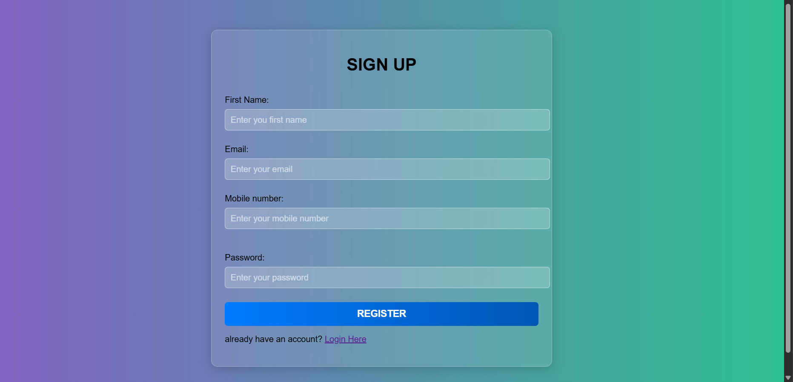
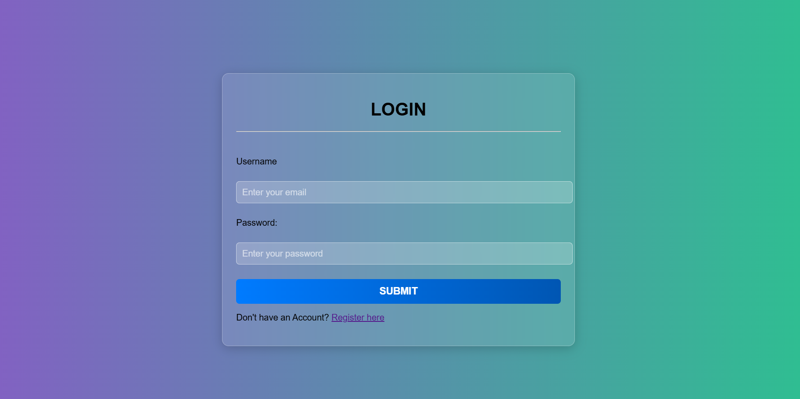
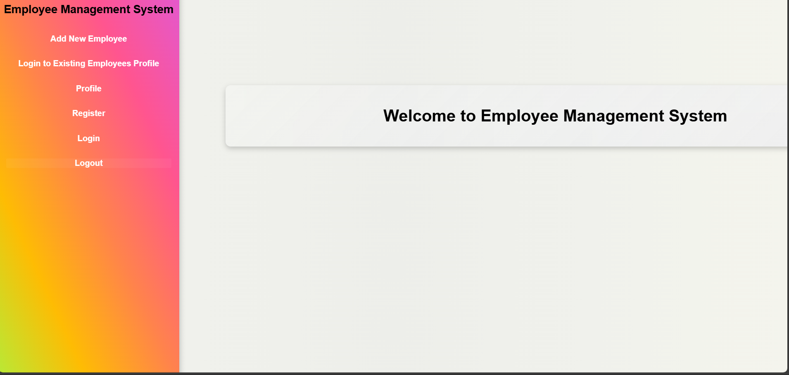
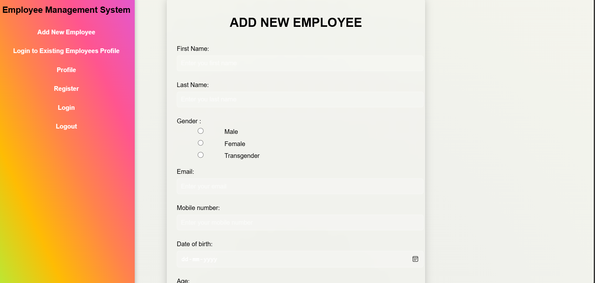
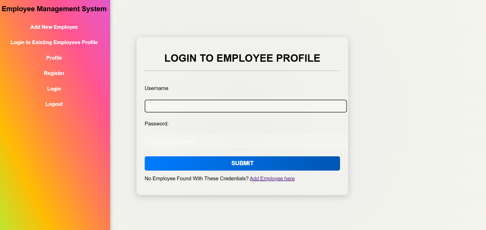
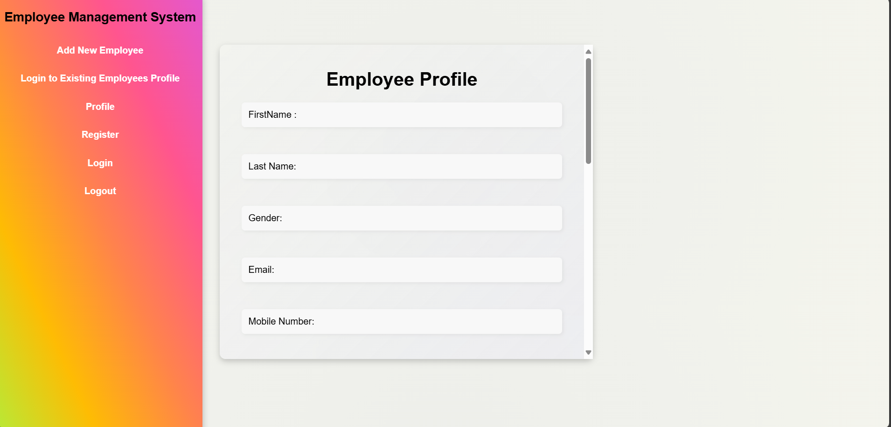
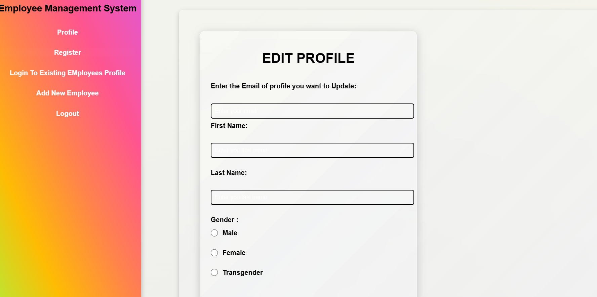
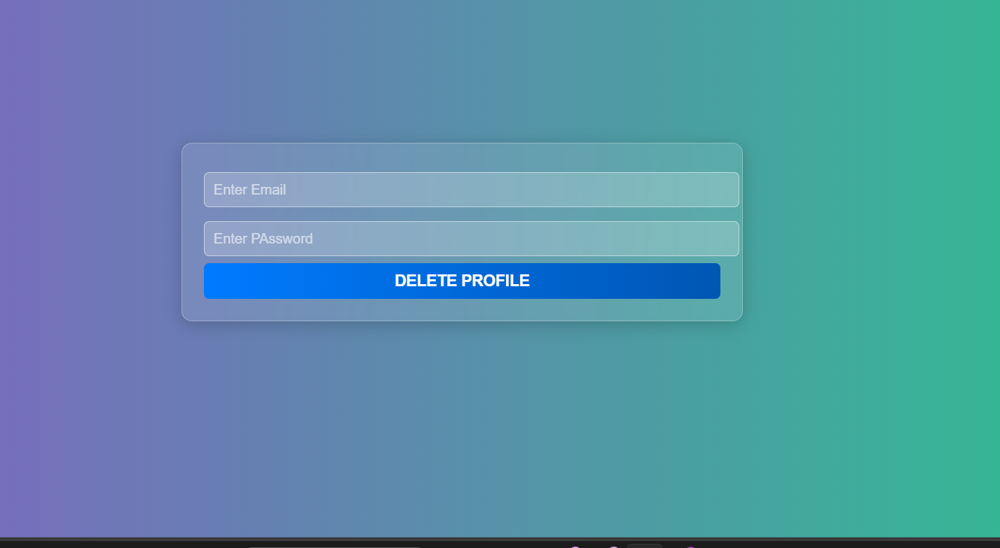
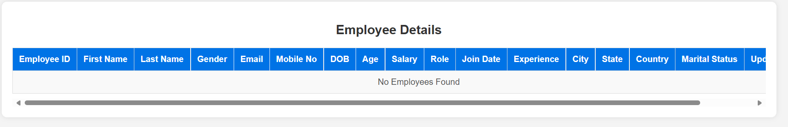

# Employee Management System

## 📌 Overview
The **Employee Management System** is a web-based application that allows organizations to manage employee records efficiently. This system enables adding, updating, deleting, and viewing employee details.

## 🚀 Features
- Employee Registration
- View Employee Details
- Update Employee Records
- Delete Employee Records
- Secure Login & Authentication

## 🛠️ Technologies Used
- **Frontend**: HTML, CSS, JavaScript
- **Backend**: Java (Servlets, JSP)
- **Database**: MySQL
- **Server**: Apache Tomcat

## 💂 Project Structure
```
Employee_Management_System/
│── src/main/java/com/jbk/      # Java Servlets
│   ├── Add_Employee.java
│   ├── Admin_login.java
│   ├── DeleteEmp.java
│   ├── EmployeesServlet.java
│   ├── Login.java
│   ├── Logout.java
│   ├── Signup.java
│   ├── Update.java
│── src/main/webapp/            # Web Application Files
│   ├── images/                 # Image Assets
│   ├── META-INF/               # Meta Information
│   ├── WEB-INF/                # Configuration Files
│   ├── add_emp.html            # Employee Registration Page
│   ├── admin_login.html        # Admin Login Page
│   ├── DeleteEmp.html          # Employee Deletion Page
│   ├── Employees.jsp           # Employee List Page
│   ├── home.html               # Home Page
│   ├── index.html              # Main Index Page
│   ├── login.html              # Login Page
│   ├── profile.jsp             # Employee Profile Page
│   ├── register.css            # Stylesheet
│   ├── signup.html             # Signup Page
│   ├── update.html             # Update Employee Page

```

## 🖼️ Screenshots
Here are some previews of the application:












## 📌 Setup Instructions
### 1⃣ Clone the Repository
```bash
git clone https://github.com/akankshabochare1604/Employee_Management_System.git
cd Employee_Management_System
```

### 2⃣ Import into Eclipse (or any Java IDE)
1. Open Eclipse and select **File > Import**
2. Choose **Existing Projects into Workspace**
3. Select the cloned repository folder
4. Click **Finish**

### 3⃣ Set Up Database (MySQL)
1. Open MySQL and create the database:
   ```sql
   CREATE DATABASE employee_management_system;
   ```
2. Import `sql/employee_db.sql` into the database.

### 4⃣ Configure Apache Tomcat
1. Open **Eclipse > Servers**
2. Add **Apache Tomcat Server**
3. Deploy the project

### 5⃣ Run the Application
- Open `http://localhost:8080/Employee_Management_System`

## 🐜 License
This project is open-source and free to use.

---

**📌 Contributor:** [Akanksha Bochare](https://github.com/akankshabochare1604)

Feel free to contribute! 🚀


